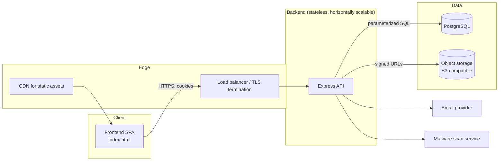

# Architecture

## System overview

## Request lifecycle

1. **Edge**: TLS terminates at the load balancer. Only HTTPS reaches the API.
2. **Security headers & CORS**: every request passes through Helmet (CSP,
   HSTS, frame-ancestors none) and a CORS allowlist before touching a route.
3. **Rate limiting**: a general limiter covers all traffic; a tighter limiter
   guards `/api/auth/*` against credential stuffing.
4. **Authentication**: `requireAuth` reads a short-lived JWT access token
   (from an httpOnly cookie or `Authorization` header) and attaches
   `req.user`. Refresh tokens are opaque, stored only as a hash, and rotate
   on every use.
5. **Authorization**: `loadMembership` + `requireRole` look up the caller's
   actual role in the `members` table on every request — the client's claim
   about its own role is never trusted.
6. **Validation**: Zod schemas reject malformed input before it reaches a
   query, with explicit length limits on every field.
7. **Data access**: all SQL is parameterized through a single `query()`
   helper; multi-statement writes (e.g. accepting an invite) run inside a
   transaction so partial writes can't happen.
8. **Response**: errors are normalized by a single handler that never leaks
   stack traces; 5xx responses return only a generic message and a request
   ID for support correlation.

## Why these boundaries

- **Stateless API containers** — sessions live in Postgres (hashed refresh
  tokens), not in server memory, so the API can scale horizontally behind a
  load balancer without sticky sessions.
- **Object storage for files, not the database** — `post_images` and
  `work_attachments` store a `storage_key`, not file bytes. Swap the local
  disk driver in `middleware/upload.js` for S3-compatible storage with
  signed URLs before production traffic.
- **Audit log is append-only** — `audit_log` rows are never updated or
  deleted by the app, so it remains a trustworthy record even if an account
  is later compromised.

## Data model summary

See `database/schema.sql` for the authoritative definition. Key
relationships:

- `teams` 1—N `members` N—1 `users` (membership carries the role)
- `teams` 1—N `posts`, `work_items`, `invites`, `announcements`
- `posts` 1—N `post_images`, `post_likes`, `post_comments`
- `work_items` 1—N `work_attachments`
- Every privileged mutation writes one row to `audit_log`
